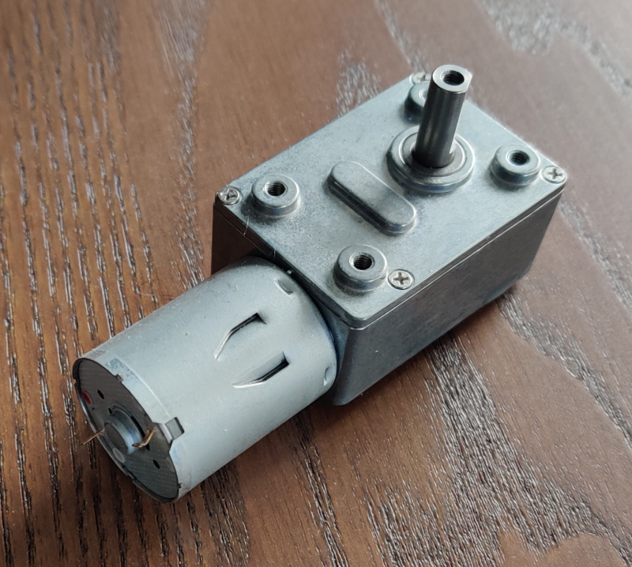
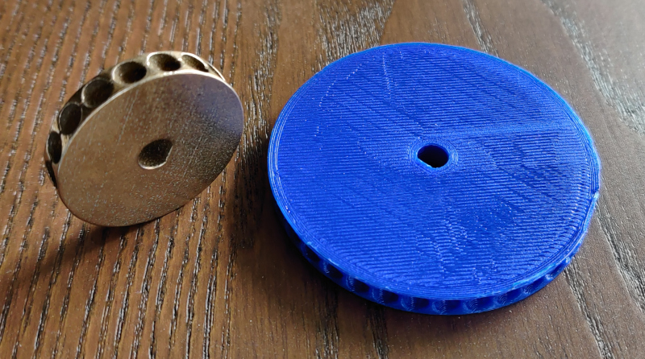
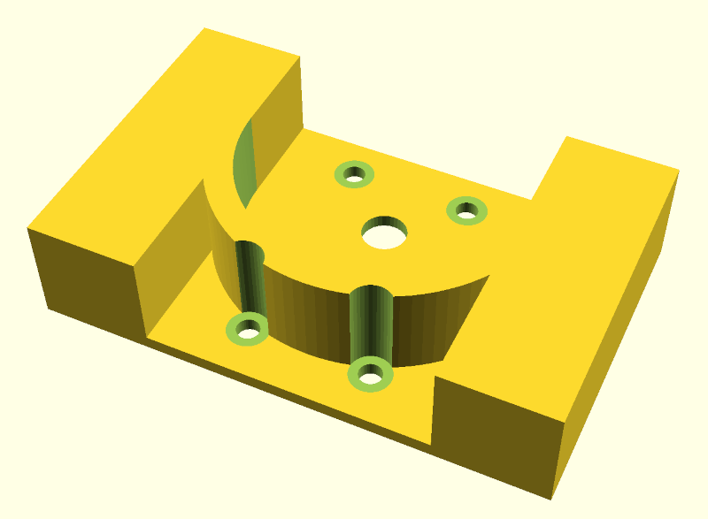
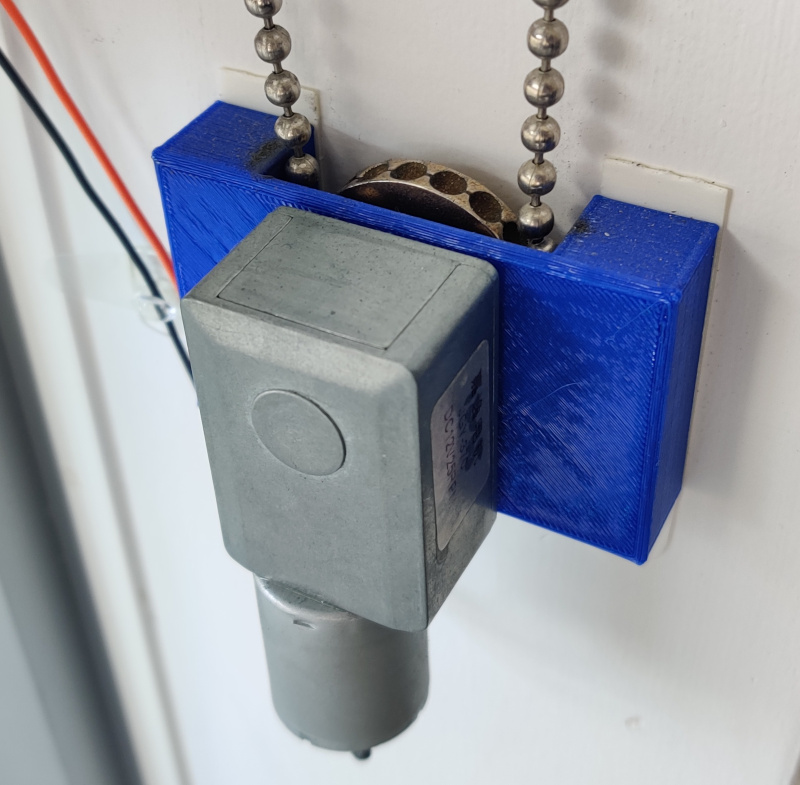
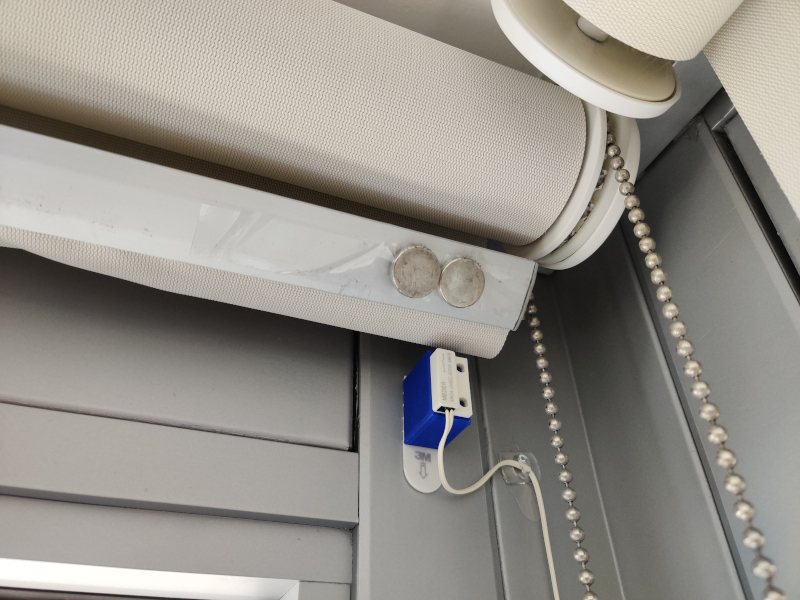
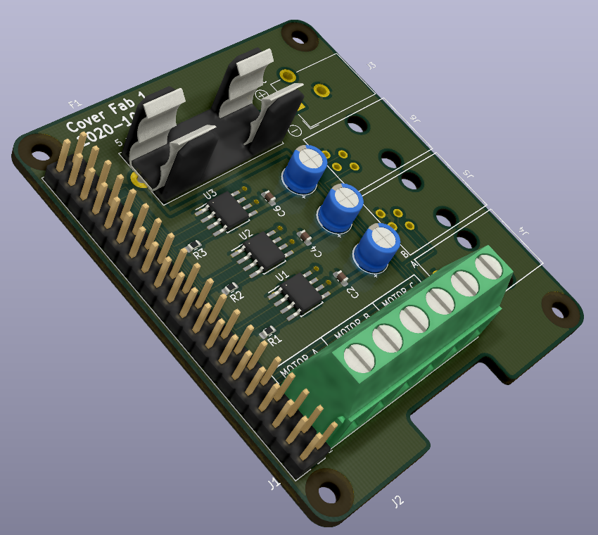
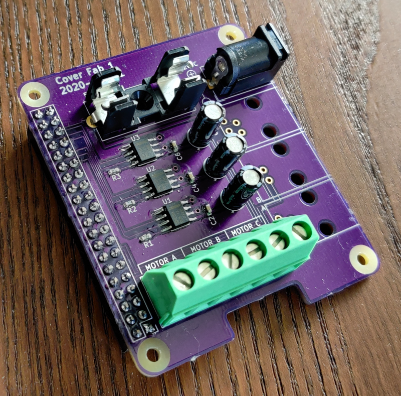
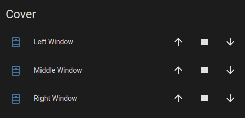

# Cover

A controller to automate my window shades.

This project is from late 2020; much older than the commit dates indicate.  I revisited it to migrate the raspberry pi controller to NixOS and decided to document the project.

## Software

* [NixOS](https://nixos.org/) for the raspberry pi OS
* [KiCad](https://www.kicad.org/) (version 5) for PCB design
* [OpenSCAD](https://openscad.org/) for 3D printed parts

## Hardware

The hardware consists of:

* A raspberry pi
* A custom pi hat to drive motors
* A motor per shade
* Plastic 3D printed motor mounts
* Metal 3D printed grips
* Plastic 3D printed guides
* 2 reed switches on each shade for endstops

### Shades

The shades on my windows have a continuous ball chain string without any clasps.  The ball chain originally had some plastic stoppers on them, but these all broke off before this project due to UV exposure.

The windows have a clutch on them, I measured the force required to overcome this clutch by tieing a water bottle onto the ball chain, and filling it with water until the chain started to move.  The final weight of the water bottle was 2 kilos ∴ about 20N of force is required to move the shades.

### Motors

I purchased generic 12V motors online, if you search "DC 12V worm gear motor" you will find these easily at almost every retailer.  These had more than enough torque to overcome the 20N of the clutch.



I purchased 25 rpm motors, which was lower than I needed.  The grips ended up being a smaller diameter than I initially intended; which means the shades move slower than intended.

#### Grips

The grip is a metal 3D printed part with grooves for the ball chain.  I tried to make this in plastic, but the forces required always stripped plastic parts.

The intent was to make this part match the diameter of the clutch on my shades, but metal 3D printing is extremely expensive, and I ended up making the part much smaller to keep costs down.  Each part ended up costing $40 from [shapeways](https://www.shapeways.com/).



#### Mount

The mount screws onto the motor and has two large flat surfaces to mount the motor onto the wall with command strips.  I used command strips because I rent, but they were probably the best solution anyway.





### Endstops

The endstops consisted of two reed switches per window, one at the top of the frame, and one at the bottom.  I taped magnets onto the shades to trip the reed switches when the shades hit the limit.



3D printed mounts were necessary to raise the reed switches to the shades.

### Controller

The controller is just a hat on a raspberry pi with 6x inputs for reed switches, and 3x DRV8871DDAR motor drivers for the output.





If I had to do this project over I would have used an Ethernet connected microcontroller instead of a pi.  Upon boot the raspberry pi takes a few seconds to apply the GPIO configuration in `/boot/config.txt`, which is not desirable, as this can lead to the shades moving beyond their endstop positions.

The controller takes commands over MQTT for move up, move down, and stop.

I run [NixOS](https://nixos.org/) on the pi.  The only other configuration necessary is putting `gpio=5,12,6,13,19,16=op,dl` into `/boot/config.txt`:

```nix
{
  boot.loader.raspberryPi = {
    enable = true;
    version = n;
    firmwareConfig = ''
      gpio=5,12,6,13,19,16=op,dl
    '';
  };
}
```

The service is a simple python script that I am not very proud of because it is all blocking code with polling.  I plan to rewrite this at some point, but it keeps working so I keep putting it off.

## Home Assistant

Home-assistant has a [MQTT cover integration](https://www.home-assistant.io/integrations/cover.mqtt/) that works out of the box.

```nix
{
  services.home-assistant.config.cover = [
    {
      platform = "mqtt";
      name = "Middle Window";
      unique_id = "middle_window";
      command_topic = "/home/sunroom/middle_window/set";
      position_topic = "/home/sunroom/middle_window/position";
      optimistic = false;
      retain = false;
    }
    # ... other shades
  ];
}
```


